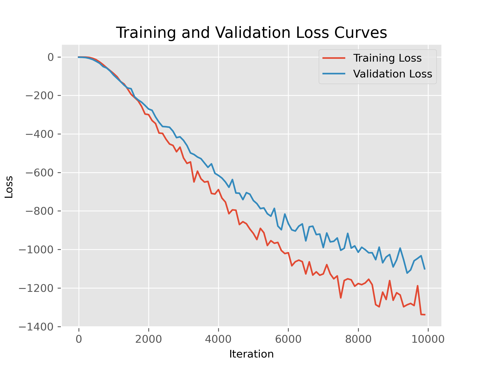
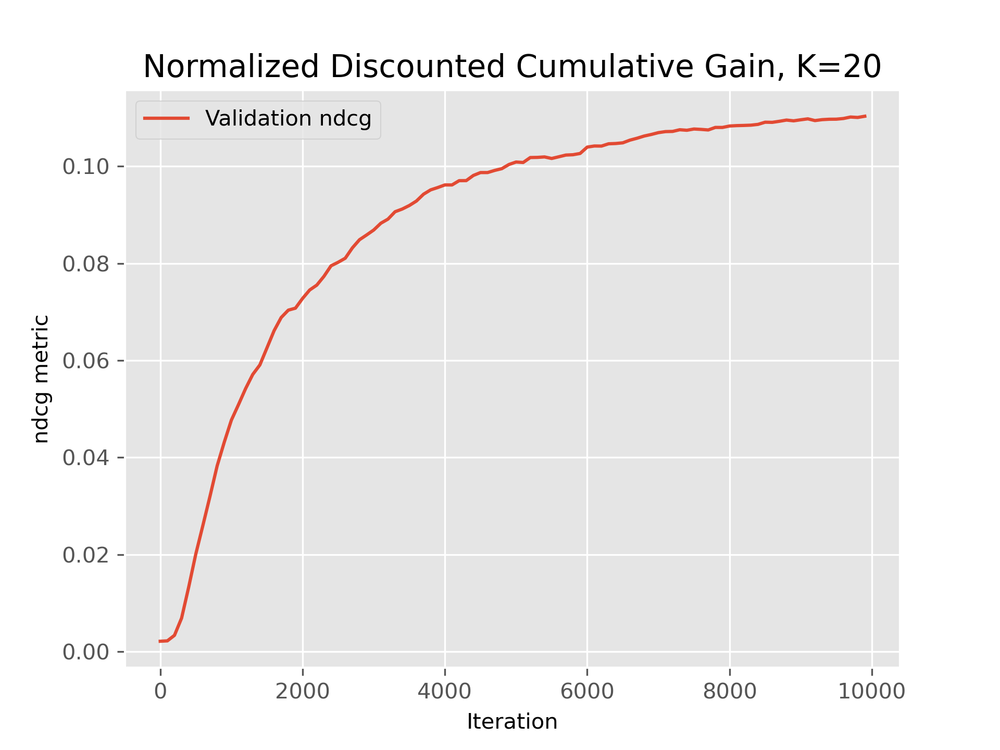

## [LightGCN: Simplifying and Powering Graph Convolution Network for Recommendation](https://arxiv.org/abs/2002.02126)

---

This folder provides a re-implementation of this paper in PyTorch. Plots obtained from training are given below. Experiments are conducted using Movielens dataset (only ratings) also provided in the repository.

- Halil Çağrı Bilgi

## Training Results

  
&nbsp; &nbsp; &nbsp; &nbsp;
  

 Loss Function: Bayesian personalized ranking (BPR) Loss

 Evaluation Metric: Normalized Discounted Cumulative Gain with K=20

### Reference Blog Posts

---

- [Light-GCN](https://medium.com/stanford-cs224w/lightgcn-with-pytorch-geometric-91bab836471e)
- [NDCG metric](https://towardsdatascience.com/evaluate-your-recommendation-engine-using-ndcg-759a851452d1)
